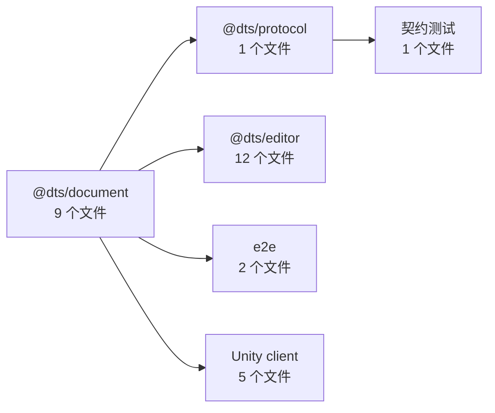

# 基线：加一个组件要碰哪些文件

> 目的：给「让加组件变成唯一的扩展手势」这件事一个**可复测的起点**。
> 阶段 1（组件规格注册表）做完后，用同一套方法再测一次，拿数字对比。
> 测量日期：本次会话。方法：全仓 grep 探针 + 逐处阅读确认（非照文档抄）。

## 0. 方法与探针选择

探针组件选 **`VideoOverlay`**，理由：

- 名字在**全仓唯一**——不会与 `kind` 重名。对比 `PlaySound` / `Teleport`：它们**既是组件名又是 kind**,计数会被污染;
- 它是最晚加进来的一条完整特性,包含「数据 + 校验 + 命令 + 面板 + 弹框 + 运行态命令 + C# 实现」全套,
  能暴露**最大**的一圈触点(其它组件都是它的子集)。

交叉验证：`GridMap` 的触点集合是 `VideoOverlay` 的子集（少了弹框、运行态播放、跨素材引用）。

**排除项（重要）**：`VideoOverlay` 是 v19 从扁平字段提升上来的，所以它的足迹里有一部分**只有老组件才有**，
新组件不需要，已从清单中剔除：

| 排除项 | 位置 | 为什么新组件不需要 |
|---|---|---|
| 迁移函数 | `schema.ts` L1039、L1304 | 只有「从 v18 扁平字段搬过来」才需要 |
| `legacyField` 字段 | `components.ts` 每条 | 新组件没有历史字段 |
| 迁移相关注释 | `types.ts` L55/L70 | 同上 |
| `FEATURE_COMPONENT_TYPES` | `components.ts` | 只服务迁移 |

## 1. 总览



| 指标 | 实测值 |
|---|---|
| 被碰的文件 | **约 30 个**（+2 个文档） |
| 其中**新建**文件 | **7 个** |
| 触及的包 / 语言 | 4 个包（document / protocol / editor / backend-test）+ Unity C# |
| 新增代码总量 | **约 2,100 行** |
| 其中**纯注册样板**（零业务逻辑，一行一条） | **约 25 行 / 15 处 / 散在 9 个文件** |

> **第一个结论：纯样板只有约 25 行，却散在 9 个文件里、横跨 TS 两个包 + C#。**
> 所以「改动大」的主因**不是行数**，而是**要记住的清单长度**（约 40 个位置）与**语言/包切换**。
> 阶段 1 的真实收益是「编译器替你记住」，不是「少打 25 行」——这一点先摆在明处。

## 2. 逐处清单

### 2.1 `@dts/document`（9 个文件）

| # | 文件 | 位置 | 要加什么 | 行数 | 新组件必做? |
|---|---|---|---|---|---|
| 1 | `src/components.ts` | L22 | `ComponentType` union 加一项 | 1 | ✅ |
| 2 | `src/components.ts` | L97-105 | `COMPONENT_TYPES` 注册表条目（displayName/slot/legacyField/tooltip/fields/gmEditable） | ~9 | ✅ |
| 3 | `src/schema.ts` | L151-161 | 数据 zod schema（`videoDataSchema`） | ~11 | ✅ |
| 4 | `src/schema.ts` | L215 | `sceneComponentSchema` 的 union 分支（`componentSchemaOf(...)`） | 1 | ✅ |
| 5 | `src/presets.ts` | L100 | `DEFAULT_SLOT_COMPONENT` 加一行 | 1 | 仅「能力组件」 |
| 6 | `src/presets.ts` | L117-118 | `OBJECT_PRESETS` 各预设 `slots` 加行 | 1/预设 | 仅「能力组件」 |
| 7 | `src/access.ts` | L114-116 | `videoDataOf` 读访问器 | 3 | ✅ |
| 8 | `src/access.ts` | L254-262 | `ensureVideoData` 写路径 | 9 | 仅「能力组件」 |
| 9 | `src/validation.ts` | L347-395 | 语义校验块 | ~48 | 视情况 |
| 10 | `src/commands/video.ts` | **新文件** | 写命令 | **195** | ✅（有可写字段时） |
| 11 | `src/commands/index.ts` | L22 | `export * from "./video"` | 1 | ✅ |
| 12 | `src/scene-asset-refs.ts` | L45 | 资源引用收集 | 1 | 仅引用素材 |
| 13 | `src/types.ts` | L208/L468 | 注释里的组件名单 | 注释 | ❌ 可选 |

小计：**约 280 行**，其中 195（命令）+ 48（校验）是真实逻辑。

> ⚠️ **`docs/CODE-STRUCTURE.md` §1.6 第 3 步是陈旧的**：它说「新建一个 `components/<你的特性>.ts` 放它的
> zod schema」,但 `packages/document/src/` 下**没有 `components/` 子目录**,全部 schema 都在 `schema.ts` 里
> （`mapDataSchema` / `soundDataSchema` / `teleportDataSchema` / `videoDataSchema`）。
> 照那份文档做会找不到地方。

### 2.2 `@dts/protocol`（1 个文件）

| # | 文件 | 位置 | 要加什么 | 行数 | 必做? |
|---|---|---|---|---|---|
| 14 | `src/messages.ts` | L304 | `COMPONENT_TYPE` 加一项 | 1 | ✅ |
| 15 | `src/messages.ts` | ~L424 | `sceneComponentSchema` union 分支 | 1 | ✅ |
| 16 | `src/messages.ts` | L60 等 | 注释名单 | 注释 | ❌ 可选 |

小计：**2 行**。**这是刻意复刻**（protocol 是最底层包,不能依赖 document）,所以这 2 行**无法靠阶段 1 消除**——
要消除只有两条路:接受 `protocol → document` 依赖,或 codegen。这是**独立的架构决策**。

### 2.3 契约测试（1 个文件）

| # | 文件 | 位置 | 要加什么 | 行数 | 必做? |
|---|---|---|---|---|---|
| 17 | `apps/backend/test/protocol-document-contract.test.ts` | L48-54 | **逐条 `expect(COMPONENT_TYPE.x).toBe(DEFAULT_SLOT_COMPONENT.x)`** | 1 | ✅ |
| 18 | 同上 | L57-78 | 遍历式断言（预设承载组件都在注册表里）——**自动覆盖，不用改** | 0 | ❌ |

小计：**1 行手写**（这一条正是「刻意复刻」的保险丝,不能删）。

### 2.4 `@dts/editor`（12 个文件）

| # | 文件 | 位置 | 要加什么 | 行数 | 必做? |
|---|---|---|---|---|---|
| 19 | `panels/inspector/registry.tsx` | L126-133 | `OBJECT_GROUPS` 加一行（group/title/applies/render） | 8 | ✅ |
| 20 | `panels/inspector/VideoFields.tsx` | **新文件** | 面板字段 | **328** | ✅ |
| 21 | `state/slices/video-slice.ts` | **新文件** | 切片（14 个 action） | **274** | ✅ |
| 22 | `state/store-types.ts` | L375-411 | action 声明（13 条 + 注释） | ~37 | ✅ |
| 23 | `state/editor-store.ts` | L36/L64 | import + 组装一行 | 2 | ✅ |
| 24 | `state/store-types.ts` | L193/L195/L244 | 状态字段（弹框开关 ×2 + 播放状态） | ~5 | 视情况 |
| 25 | `state/store-context.ts` | L115/L137/L646/L727 | `videoTargetOf` + `deliverVideo` + 补发 | ~80 | 视情况（有运行态命令才要） |
| 26 | `services/video-playback.ts` | **新文件** | 期望播放状态记账 | **92** | 视情况 |
| 27 | `app/VideoEditDialog.tsx` | **新文件** | 编辑弹框 | **273** | 视情况 |
| 28 | `state/initialState.ts` | L44-45/L68 | 初始状态 | ~4 | 视情况 |
| 29 | `state/slices/history-slice.ts` | L129-131 | 撤销/重置时清状态 | 3 | 视情况 |
| 30 | `state/slices/project-slice.ts` | L461-480 | 换工程时重置 | ~20 | 视情况 |
| 31 | `app/EditorShell.tsx` | — | 弹框挂载 | ~3 | 视情况 |

小计：**约 1,130 行**。注意 **`state/` 一个目录就占了 8 个文件**——这是「巨型 store 拆成 16 个切片」的直接后果:
一个特性要横着插进 slice / store-types / context / initialState / history / project 六处。

### 2.5 e2e（2 个文件）

| # | 文件 | 位置 | 要加什么 | 行数 | 必做? |
|---|---|---|---|---|---|
| 32 | `e2e/helpers/editor.ts` | L50 | `COMPONENT` 常量加一项 | 1 | ✅ |
| 33 | `e2e/helpers/editor.ts` | L687+ | 读场景文件的助手 | ~15 | 视情况 |
| 34 | `e2e/video-object.spec.ts` | **新文件** | E2E | ~300 | 建议 |

> `e2e/helpers/editor.ts` L39-40 写着：「e2e 不引用内部包,所以这里是**复述**」——
> 又一处**刻意复刻**（第 3 份组件名单）。

### 2.6 Unity client（5 个文件）

| # | 文件 | 位置 | 要加什么 | 行数 | 必做? |
|---|---|---|---|---|---|
| 35 | `Presentation/VideoOverlay.cs` | **新文件** | MonoBehaviour（**行为本体**） | **354** | ✅ |
| 36 | `Presentation/SceneObjectView.cs` | L96/L350/L417 | 挂载 + 属性 | ~10 | ✅（会渲染才要） |
| 37 | `Network/Protocol.cs` | L81 | 组件名常量 | 1 | ✅ |
| 38 | `Data/SceneParser.cs` | L143-145 | `switch` 加 `case` | 3 | ✅ |
| 39 | `Data/SceneModel.cs` | L177 | 镜像字段 | ~5 | ✅ |

小计：**约 373 行**，其中 354 是**行为本体**——这部分**任何架构下都躲不掉**（Unity 里每个功能也都要写 MonoBehaviour）。

## 3. 三类成本的划分（这是基线里最有用的部分）

| 类别 | 内容 | 量 | 能否靠重构消除 |
|---|---|---|---|
| **A. 行为代码** | C# 类、面板字段、切片、命令、弹框、校验 | **约 1,600 行** | ❌ 不能——这就是写功能本身 |
| **B. 接口/接线** | `store-types` action 声明、`editor-store` 组装、`initialState`/`history`/`project` 三处重置、`store-context` 的 target/deliver | **约 150 行 / 11 处** | ⚠️ 部分——取决于 store 怎么切 |
| **C. 纯注册** | components union+注册表、schema union、presets、契约测试、protocol 2 行、`registry.tsx`、e2e COMPONENT | **约 25 行 / 15 处 / 9 文件** | ✅ 完全可以 |

**C 是阶段 1 的靶子。B 是阶段 2/3 的靶子。A 不用管。**

## 4. 「能力组件」vs「普通组件」两条路径

现在的 6 个组件全都是**能力组件**（自报 `slot`），因为它们都是 v19 从对象特性提升上来的。
但如果新组件**不需要被「按能力找到」**（没有 `mapDataOf` 那种访问器需求），
可以走**更便宜的路径**，直接省掉 4 处：

| 位置 | 能力组件 | 普通组件 |
|---|---|---|
| `presets.ts` `DEFAULT_SLOT_COMPONENT` + `OBJECT_PRESETS.slots`（#5/#6） | 要 | **省** |
| `access.ts` `ensureSlotData`（#8） | 要（有 kind 闸门） | **省**（直接用 `writeFeature`） |
| `validation.ts` 里的 `supportsXxx(kind)` 判断 | 常有 | **省** |
| `access.ts` 的 `xxxOf` 别名（#7） | 要 | **省**（用现成的泛型 `componentDataOf<T>(object, type)`） |
| 面板 / protocol / C# | 要 | 要 |

**这是一个重要发现**：`ComponentTypeDef.slot` 本来就是**可选的**（`components.ts:37`），
普通组件的路径**已经通了**——只是仓库里还没有第 7 个组件来走它。
所以「加组件」的门槛**比看起来低**，前提是**不要给新组件硬加 `slot`**。

## 5. 阶段 1 之后的预期基线（做完再测，用来对比）

| 指标 | 现在 | 阶段 1 后（预期） |
|---|---|---|
| 纯注册处数 | 15 处 / 9 文件 | **3 处 / 3 文件** |
| —— document | 6 处 / 3 文件（#1-#6） | **1 处 / 1 文件**（新增一个 spec 文件） |
| —— protocol | 2 行 / 1 文件 | 2 行 / 1 文件（**刻意复刻，不变**） |
| —— 契约测试 | 1 行 | 1 行（**保险丝，不变**） |
| —— 面板 | 1 行 / 1 文件 | 1 行 / 1 文件（不变） |
| 要记住的清单长度 | 约 40 个位置 | **约 20 个位置** |
| 行数 | 约 2,100 | 约 2,100（**几乎不变**） |

**关键预期：行数几乎不变，清单长度减半。** 如果重测后发现行数也没降，说明
阶段 1 只做了搬运——那就要重新评估是否值得继续阶段 2。

## 6. 阶段 2 的靶子（`kind` 降级 + 挂/摘组件）

阶段 1 治的是「注册样板」。阶段 2 治的是**另一个场景**：

| 场景 | 现在 | 阶段 2 后 |
|---|---|---|
| 「加一个**新的**组件」 | 约 40 个位置 | 约 20（阶段 1 的成果） |
| 「加一个**已有组件的组合**」（例：会放视频又会响的对象） | **改 `OBJECT_PRESETS` 加预设 + 可能要新 kind + 新工厂** | **挂上去就行，0 处注册** |
| 「给已有对象加一个能力」 | **做不到**（kind 闸门 `access.ts:215`） | `addComponent(objectId, type)` |

所以两阶段的收益**不重叠**：
- 阶段 1 = 让「加组件」这件事忘不掉（编译器强制）；
- 阶段 2 = 让「组合已有组件」这件事**不需要新组件**。

如果你最痛的是「每换一种对象组合就要加一个 kind」,那**阶段 2 才是你的靶子**，阶段 1 只是它的前置。

## 7. 怎么复测

```bash
# 1) 选名字唯一的探针组件（避开与 kind 同名的）
# 2) 按包分别 grep，逐处阅读确认「要加什么 / 几行」
#    server/packages → server/apps → server/e2e → client
# 3) 剔除 legacy-only 项（迁移函数 / legacyField / 迁移注释）
# 4) 按第 3 节三类归档，重点看「纯注册」的处数与文件数
```

新组件探针的候选：下一个要加的组件（名字唯一即可）。**不要**用 `PlaySound` / `Teleport` /
`Sprite` / `Image` / `Map` 作探针——它们与 kind 或槽位名重叠，计数会虚高。

## 8. 复测时要一起核对的陈旧文档

| 文档 | 陈旧点 | 影响 |
|---|---|---|
| `docs/CODE-STRUCTURE.md` §1.6 第 3 步 | 说 schema 放 `components/<x>.ts`,该目录不存在 | 会找不到地方放 schema |
| `docs/CODE-STRUCTURE.md` §1.6 第 8 步 | 说「加一个分组视图组件」,没说注册表键控 | 与本次讨论的阶段 1 目标不一致 |
| `docs/ANALYSIS-实体组件与重复实现.md` | 2025-06 快照:`features.ts` / `kinds.ts` / 13 种组件 / `actions[]` 均已不存在 | 按它做判断会被带偏 |

---

# 附：小功能基线（加一个布尔值）

上面那份测的是「加一个**组件**」（最大的改动）。日常最常被抱怨的是「加一个**小小功能**」——
两者不是一回事，所以单独量一份。探针：`autoPlay`（视频的「场景激活时自动播放」，一个布尔值）。

## 改造前：19 个文件

| 税 | 文件 |
|---|---|
| document 铺线 | `types.ts` · `schema.ts` · `presets.ts` · `commands/video.ts`（命令 + 创建默认值）· `access.ts` |
| **T2 store 税** | `state/store-types.ts` · `state/slices/video-slice.ts` |
| 编辑器 UI | `panels/inspector/VideoFields.tsx` |
| **T1 复刻税** | `packages/protocol/src/messages.ts` |
| **T3 镜像税** | `client/.../Data/SceneModel.cs` · `client/.../Data/SceneParser.cs` |
| 客户端接线 | `client/.../Network/BackendManager.cs`（一次性，非税） |
| **真实逻辑** | `client/.../Logic/SceneMirror.cs` · `client/.../Logic/CommandRouter.cs` |
| 测试 / 夹具 | `protocol.test.ts` · `video-object.test.tsx` · `video.test.ts` · `场景1.json` |
| 文档 | `README.md` 等 |

**19 个文件里只有 2 个含真实逻辑。**

## 阶段 A 之后：7 个文件（−53%）

| # | 文件 | 为什么还要碰 | 哪个阶段能消掉 |
|---|---|---|---|
| 1 | `packages/document/src/types.ts` | `VideoDataDoc` 加这个键——规格的 `keyof TData` 约束要求接口里真有它 | 设计如此（保类型安全） |
| 2 | `packages/document/src/schema.ts` | zod 字段（规格**不**驱动 schema：默认值语义写在长注释里，派生有静默改语义的风险） | **阶段 A2** |
| 3 | `packages/document/src/component-specs/video.ts` | 描述符一行 ← **唯一的新增必写点** | —— |
| 4 | `packages/protocol/src/messages.ts` | T1 复刻（`protocol: []` 被架构测试守住） | **阶段 C（需决策，暂缓）** |
| 5 | `client/.../Data/SceneModel.cs` | T3 手抄镜像字段 | **阶段 B** |
| 6 | `client/.../Data/SceneParser.cs` | T3 手抄解析行 | **阶段 B** |
| 7 | 真实行为（1 个文件，随功能而定） | 这个功能本身 | 不能也不该消除 |

**不再需要碰的 6 个文件**（改造前必碰）：
`presets.ts`、`commands/video.ts`、`access.ts`、`state/store-types.ts`、`state/slices/video-slice.ts`、
`panels/inspector/VideoFields.tsx`。

### 诚实的偏差：S5 没达标

计划里把验收标准 S5 写成「阶段 A 后 ≤5 个文件」。**阶段 A 实测是 7，没达标。**
两处漏算：`types.ts`（规格的类型约束要求接口里真有这个键）与 `protocol`（T1 是阶段 C 的决策，本次没做）。

到 ≤5 的路径：阶段 A2 派生 schema（−1）+ 阶段 B 客户端泛型读取（−2）= **7 → 4**。
也就是说：**本目标的达成依赖 A2 与 B，阶段 A 只是把 store 与面板那两处止血了。**

**阶段 B 做完后：7 − 2 = 5 —— S5 达标。** 剩下 5 个里 `types.ts` / `schema.ts` 是文档形状
（A2 可再消掉 schema 那一处），`protocol` 是待决策的 T1，最后 1 个是功能本身。

## 阶段 A 的验证结果（可复核）

| 标准 | 结果 |
|---|---|
| S1 既有测试零改动全绿 | ✅ `git status` 无任何既有测试文件改动；`pnpm test` 1133 passed / 78 files，exit 0 |
| S2 e2e 零改动 | ✅ 未改任何 e2e 文件；相关 spec 24 passed，**2 个失败在基线 HEAD 上逐字复现**（`video-object.spec.ts:157` 的 GUID/路径、`object-edit.spec.ts:742` 的 30s 超时）；`@runtime` 那条同样基线复现 |
| S3 协议 / 格式不变 | ✅ `PROTOCOL_VERSION` / `DOCUMENT_FORMAT_VERSION` 未动；无迁移 |
| S4 架构边界测试零改动 | ✅ `server/test/architecture.test.ts` 未改且通过 |
| S6 `pnpm check` | ✅ typecheck + test + lint 全绿 |
| S5 触碰文件 ≤5 | ⚠️ 阶段 A 实测 7；**阶段 B 后为 5，达标**（见下） |

**e2e 失败的复现方法**（下次别把它当成本次引入的回归）：`git stash push -u` → `pnpm build` →
跑同一条 spec → `git stash pop`。本次三条失败用例都这么跑过，结果逐字相同。

**跑 e2e 的两个坑**（本次踩了，记下来）：
1. `@runtime` 的用例必须**串行**（`pnpm e2e` 分两趟就是这个原因）；混在 4 worker 里跑会连带打坏邻居；
2. PowerShell 里 `--grep-invert @runtime` 的 `@runtime` 会被当成**数组子表达式**解析，
   必须写成 `'--grep-invert=@runtime'`，否则参数错位、`--project` 也跟着失效。

## 阶段 B 的验证结果（Unity MCP）

阶段 B 原先的验收写着「本环境没有 Unity，只能静态审查」。**这一条已经不成立**：
Unity MCP（`MCP for Unity` v10.1.0，`http://127.0.0.1:8080/mcp`）接上了 Unity 6000.3.19f1、
项目 `E:/WorkSpace/DiceTaleStudio/client/Assets`，所以 C# 侧是**真的编译并跑过**的。

| 标准 | 结果 |
|---|---|
| 改动面 | `SceneModel.cs` 加 4 个读取器 + 类注释；`client/README.md` 加一段规矩。**没有改任何既有镜像字段、没有改 `SceneParser`** |
| 编译 | ✅ `refresh_unity`（`mode=force, scope=scripts, compile=request`）→ `read_console` **0 error / 0 warning** |
| 功能 | ✅ `execute_code` 在编辑器里实跑 12 条断言全对：布尔真/假；**类型不对 → 落回 fallback**（默认 `false`、自定义 `true`）；缺键 → fallback；问错组件 → fallback；字符串正常与缺失（`null`）；数字保留小数（`1.5` 没被悄悄取整）；数字 fallback；`ComponentData` 对没挂的组件返回 `null`；**`HasComponent` 行为不变（无回归）** |
| 回归手段 | ⚠️ `client/Assets` 下**没有**工程自带的测试 asmdef（`*.asmdef` 全在 `Library/PackageCache`），所以只能靠「编译干净 + 既有代码零改动 + 上面那条 `HasComponent` 断言」 |

**怎么复现**：MCP 是 Streamable HTTP，用任意 JSON-RPC 客户端
`initialize` → `notifications/initialized` → `tools/call` 即可。本次用一个临时 PowerShell 脚本驱动
（`$env:TEMP\unity-mcp.ps1`）。**两个坑**：
1. 参数**不能叫 `$Args`**——那是 PowerShell 的自动变量，会静默吞掉参数（表现为 `arguments: {}`，服务端报 missing argument）；
2. 工具参数名要先看 `tools/list` 的 `inputSchema` 再调（`refresh_unity` 的参数是
   `mode` / `scope` / `compile` / `wait_for_ready`，不是想当然的 `action` / `wait_for_completion`）。

有用的工具：`read_console`、`refresh_unity`、`execute_code`、`validate_script`、`find_in_file`、`unity_reflect`。

### 过程中抓到的两个真实 bug（说明这套验收标准有效）

1. **immer 报「returned a new value *and* modified its draft」**：`component-slice` 的 recipe
   用简洁箭头把命令的布尔值 `return` 了出去，immer 把它当成「返回了新状态」。
   既有 `video-object.test.tsx`（零改动）当场抓出来。修法是 recipe 用块级函数丢弃返回值——
   「有没有变更」由补丁数决定（`DocumentHistory.apply`），与其它切片一致。
2. **`FieldDef<T>` 的 `keyof T` 把接口变成不变的**，于是「规格里的字段」赋不进「泛型字段列表」。
   改成在 `defineComponent` 的**入参**上用 `TypedFieldDef<TData>` 约束键名：
   编译期检查一样在，`ComponentSpec` 保持可变、能按 `string` 索引。

---

# 后续各项的处置（#4 / #8 / #5 / #3 / #1）

## #4 三条陈旧 e2e：已修（不是产品 bug）

先做的是这三条，因为定级之后发现它们**比预估便宜得多**，而且是纯测试改动。三条的真实原因：

| 失败 | 真实原因 |
|---|---|
| `video-object.spec.ts` 的两条 | 场景文件**按设计**存素材 **GUID** 而不是逻辑路径（`scene-asset-refs.ts`：「Persist scene asset identity as GUIDs while keeping logical IDs in memory」）。spec 仍在断言路径形式 → 改成断言**结构**（两条、顺序保持、第一条被选中、名字挂在第一条上）+ 32 位十六进制匹配 GUID，`clips[0]` 是 `a` 由 UI 那条小方块断言兜住 |
| `object-edit.spec.ts:742`「精灵显示图片」 | 精灵对象的选图弹框**只列 `type === "Sprite"` 的图**，而**没有 `.meta` 的素材默认是 `Default`**（`spriteSettingsOfMeta`），列表为空 → 选择器等 30s 超时。修法是新增 `seedImageSpriteMeta` 先把 meta 写成 Sprite（界面那条路归 `sprite-sheet.spec.ts`） |
| 同上，第二处 | 面板对**精灵**不显示贴图路径（v21 设计：精灵显示的是「取图集哪一格」），那条断言改成「不再是无贴图」；「显示简化路径」归贴图对象那条用例 |

**没有一条是数据损坏或功能坏了。** 修完后这 3 条全绿，而且**没有为了让它们变绿而放宽任何真实断言**。

## #8 基础字段走规格：已做（迁移 `sortingOrder`）

新增 `packages/document/src/object-spec.ts`（`OBJECT_SPEC` + `defineObjectSpec` + `objectFieldOf`）
与 `setObjectField`；`DescriptorRows` 抽出 `FieldTarget`（`componentFields(type)` / `objectFields`），
**同一套行渲染器服务组件字段与对象字段**。`SortingOrderField`（45 行手写控件）删掉，
`setObjectSortingOrder` 改为转发到泛型写入——范围（±9999 + 取整）搬进描述符，
`document.test.ts` 里那几条夹取断言**零改动**通过。

**诚实结论：7 个基础字段里只有 `sortingOrder` 是「无专属语义」的标量。** 其余六个各有一件
描述符表达不了的东西（改名联动贴图 / 写运行日志 / 等比折叠 / 弧度↔度换算 / `position: null` 落位），
所以刻意留在手写路径上，理由逐条列在 `object-spec.ts` 的表里。**#8 的价值因此是「下一个普通标量
字段只改一处」，而不是「把 7 个字段都搬过来」**——这一点我在动手前低估了。

## #5 死机制：已清

`ComponentTypeDef.fields`（6 个组件全是 `[]`）与 `defaultComponentData` **删掉**，字段的归属地
只剩组件规格一处；`defaultDataOf` 从 `access.ts` 搬到 `component-specs/index.ts`
（它是「关于规格」的问题；放 access 会绕出 `components → access → components` 的环）。
`document.test.ts` 里那条测 `defaultComponentData` 的用例随之删除，等价断言搬到
`component-field.test.ts` 测 `defaultDataOf`。

## #3 陈旧文档：已加过期横幅

`docs/ANALYSIS-实体组件与重复实现.md` 是 2025-06 快照，已在文首加一张逐条对照表
（13 种组件 → 6 种、`features.ts` / `kinds.ts` 已删、`OBJECT_KIND_DEFS` 不存在、
`actions[]` 已整层删除、`@dts/actions` 已删、protocol 复刻仍在）。
**没有删这份文档**：它 §2.1③ 那三对同构拷贝（播放记账 ×3、Sound/Video 弹框、Fog/Grid 窗口+切片）
还没合并，那份对比仍然有用。

## #1 阶段 A2（派生 zod schema）：**定级为「无合格对象」，延后**

计划给 A2 设的前提是「**只对描述符完全可表达的组件**做」。核对了 6 个组件之后：
**没有一个合格。** 规格是有意**部分**的——每个组件的规格只登记「无条件、无副作用、控件形状确定」
的标量，其余字段（列表 / 引用 / record / 嵌套对象）刻意留在外面：

| 组件 | schema 的字段 | 规格接管的 | 可派生? |
|---|---|---|---|
| `VideoOverlay` | `enabled` / `autoPlay` / `clips` / `picked` / `names` / `loop` / `audio` | `loop` / `audio` / `autoPlay` | ❌ 4/7 在外 |
| `PlaySound` | `clips` / `picked` / `names` / `layer` | 无（没搬） | ❌ |
| `Teleport` | `targets` / `picked` | 无 | ❌ |
| `ImageLayer` / `SpriteLayer` | `ImageRef`（嵌套对象） | 无 | ❌ |
| `GridMap` | `image` / `grid` / `rowOrder` / `cells`(RLE) / `fog` | 无 | ❌ |

要做 A2 只有两条路，**两条都不好**：

1. 扩 `FieldKind`（加 `stringMap`、带 `minLength` 的数组…）把那些字段也描述出来——
   但那些字段**不该**被泛型写入接管（有副作用 / 要同步旁路数据），于是描述符要再分
   「能写」与「只描述」两类，机制变浑；
2. 派生一部分 schema、剩下手写拼接——那就**又变成同一个形状两个来源**，正是 #5 刚清掉的那种 wart。

所以 A2 的正确状态是：**等出现一个「数据全是简单标量」的组件再做**，那时它是零成本的
（一行 `zodFromFields(fields)`）。现在硬做只会引入一个坏抽象。
**这是本次唯一一项「决定不做」的，理由是「没有合格对象」，不是「没时间」。**

---

## 本轮收尾的最终验证（全量）

| 项 | 结果 |
|---|---|
| `pnpm check`（typecheck + 单测 + lint） | ✅ exit 0；**1139 个单测 / 78 个文件全绿** |
| 全量 e2e（非运行态，3 个档位） | ✅ **341 passed / 0 failed** |
| 全量 e2e（`@runtime`，串行） | ✅ **9 passed** |
| Unity（C#） | ✅ 控制台 **0 error / 0 warning**（只改了客户端 `SceneModel.cs` 的读取器，编译 + 12 条断言实跑通过） |

**「既有测试零改动」这条约束的例外（如实记录）**：只有一处——`document.test.ts` 里那条
测 `defaultComponentData` 的用例**删掉了**，因为 #5 把这个函数删了（它是死代码）。
等价断言已搬到 `component-field.test.ts` 测 `defaultDataOf`。除此之外没有改任何既有测试的断言
（e2e 那几处改动见下面「#4」与「#6」，都是陈旧断言）。

**结论：全仓 e2e 现在是 0 红。**

---

# 又一轮：把基线就红的 8 条 e2e 也修了（#6）

上一轮结束时全量 e2e 是「341 条里 8 条红」，而那 8 条**在基线 HEAD 上逐字复现**——
也就是说它们是**在我动手之前就红的**。这一轮把它们收拾干净了：**341 passed / 0 failed**。

三类根因，全都是**陈旧断言或陈旧夹具**，没有一条是产品缺陷：

| 失败的用例 | 根因 | 修法 |
|---|---|---|
| `hierarchy.spec.ts:279`（×3 档位）「旧版场景文件（v18）打开时自动升级」 | 期望里写着 `actions: []`，而 **`ComponentDoc` 早就没有 `actions` 了**（`invoke_action` / `register_*` 那套旧模型整层删除，zod 解析时把它静默丢掉）。`componentInstanceOf` 返回的是解析后的组件，所以 `.toEqual` 永远差这两个键 | 从期望里删掉两处 `actions: []` |
| `sound-object.spec.ts:58`（×3 档位） | 与视频那两条**同一个根因**：场景文件按设计存**素材 GUID**（`sceneAssetRefsToGuids`），用例还在断言逻辑路径 | 改成断言结构：两条、都是 GUID、互不相同、选中的是第二条、名字挂在第一条上（「哪条是哪条」由同一条用例里的 UI 断言兜住） |
| `video-object.spec.ts`「贴图也有这一组」（×2，**只 tablet**） | **抽屉遮挡**：`openFirstObject` 会把属性面板露出来（平板下是**右抽屉**），而「对象」按钮在场景标题栏的**最右端**——竖屏平板上正好被右抽屉的遮罩盖住，`click()` 一直等可点击直到 30s 超时。桌面上没有抽屉所以一直是绿的 | 建对象前 `await closeDrawers(page)`（仓库既有约定，桌面档位是空操作） |

**顺带清掉一个会误导人的夹具**：`helpers/editor.ts` 的 `withComponent` 以前给组件多写一个
`actions: []`——因为 zod 会静默丢掉，所以它从没导致失败，但**它让「组件上还有 `actions`」看起来
像是真的**（`hierarchy.spec.ts` 的期望就是照着它写的，于是那条用例一直红着）。已删掉并把
函数的注释改成「组件实例只有 `id` / `type` / `data`」。

**一个留下的产品观察（没有改，供你判断）**：平板竖屏下两个抽屉同时打开时，画布标题栏最右端的
「对象」按钮会被右抽屉的遮罩盖住——真人会先关抽屉，所以不算坏；但如果你希望它在任何抽屉状态下
都可点，那是另一个改动（把按钮挪出被遮挡区域，或让抽屉遮罩不拦它）。
